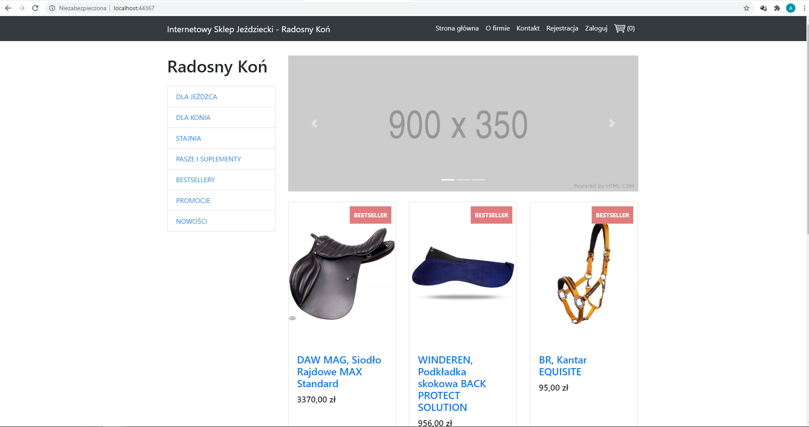
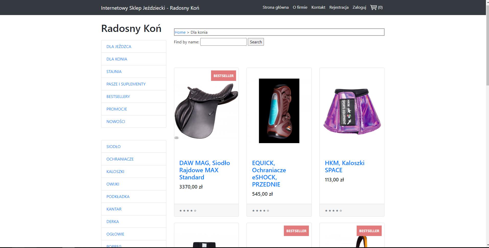
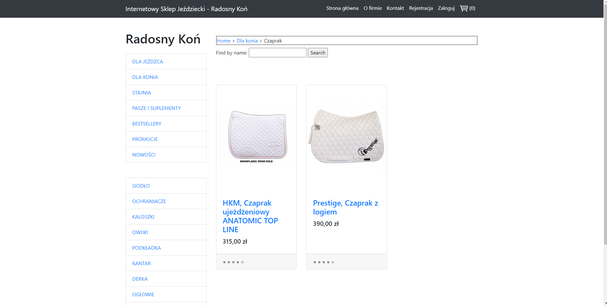
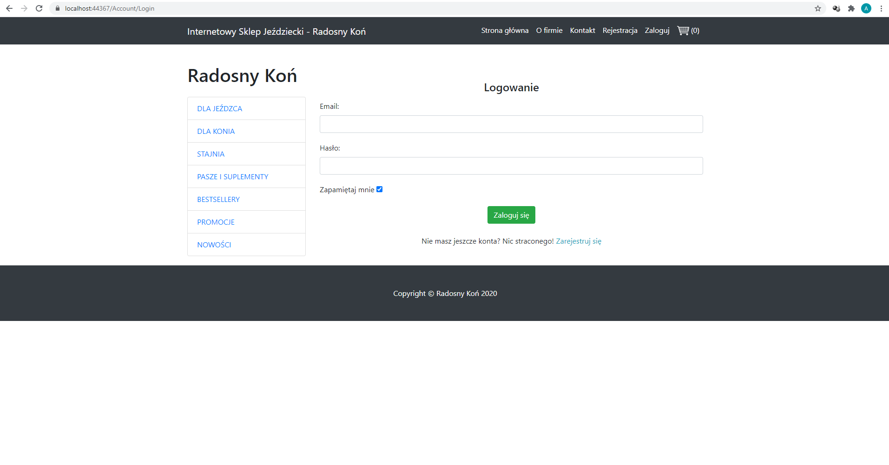
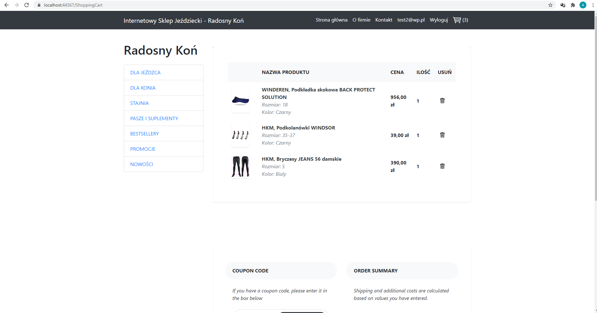
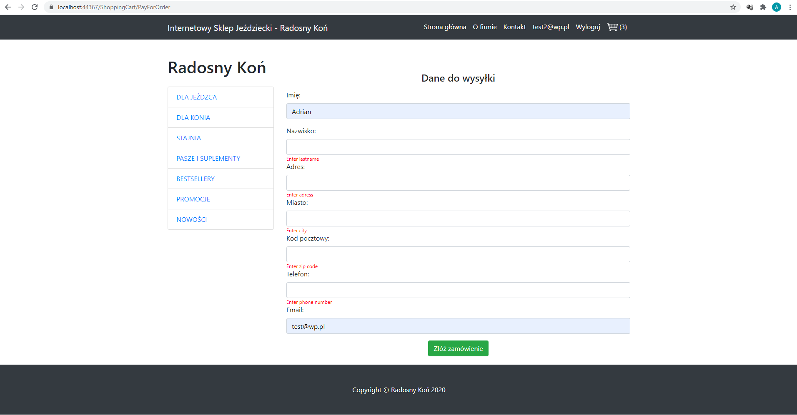
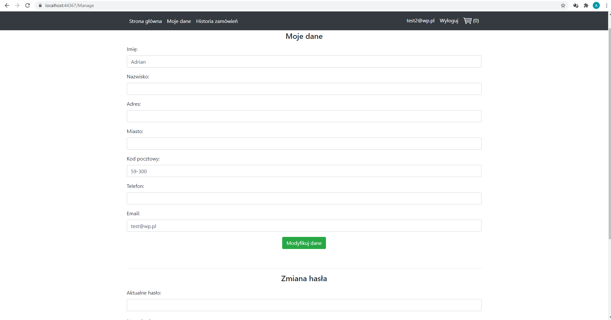
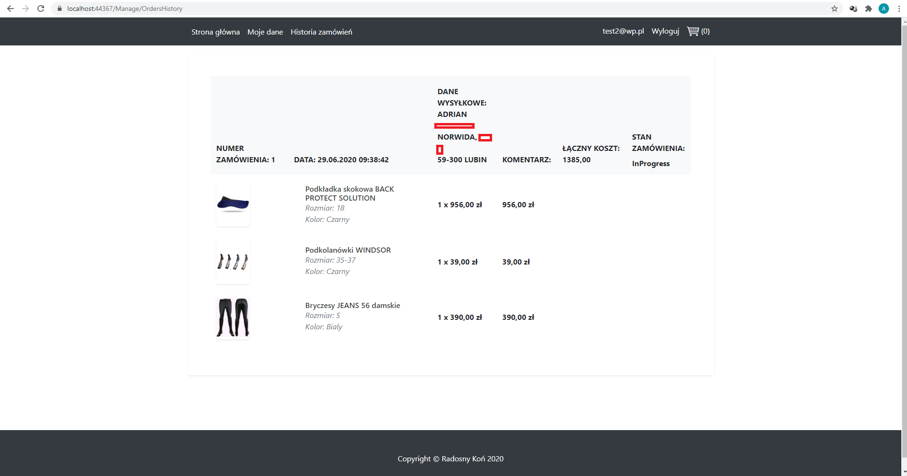
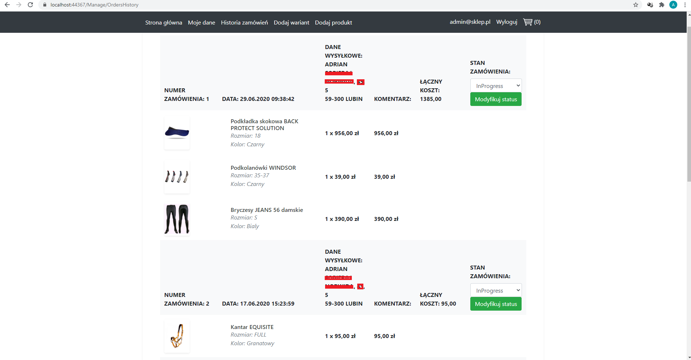
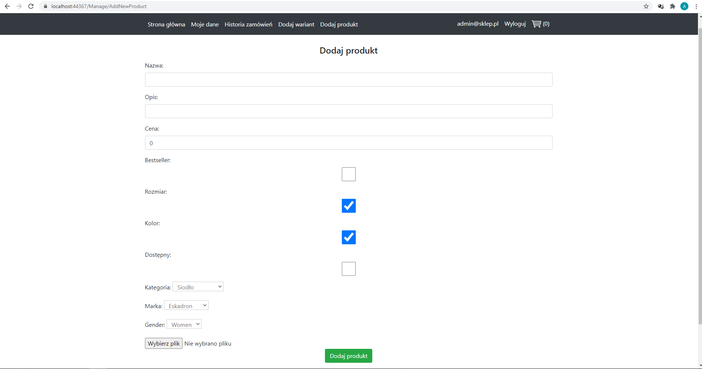

# EquestrianStoreOnline-MVC
Equestrian online shopping store based on ASP.NET MVC

## Table of contents
* [General info](#general-info)
* [Main technologies](#technologies)
* [Screenshots](#screenshots)

## General info
Equestrian online store application that allows to, among others, browse the store’s offer, create a user account and place an order. The purpose of the project is to learn ASP.NET platform and architectural pattern - MVC.

## Main technologies
* .NET Framework - version 4.7.2
* C# - version 7.3
* ASP .NET MVC - version 5.2.7
* EntityFramework - version 6.4.0
* jQuery - version 3.5.0
* SQL Server

## Screenshots
* Main page

* Main category page

* Category page

* Product details page

* Register page

* Login page

* Shopping cart page

* Pay order page

* Account manage page

* History of orders page

* History of orders admin page

* Add new product from admin account

