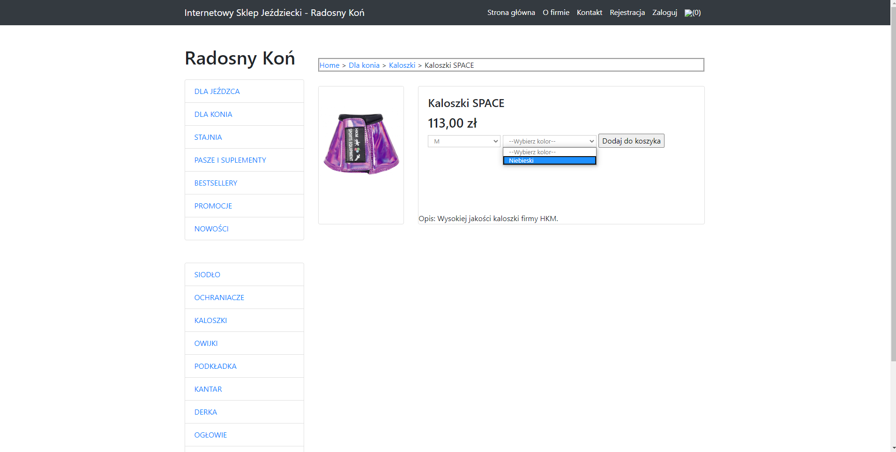
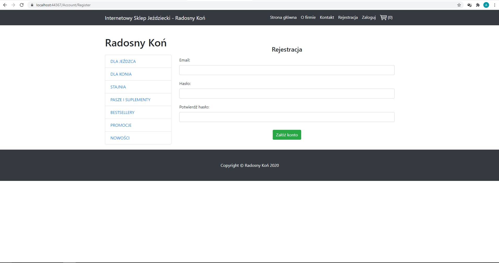

# EquestrianStoreOnline-MVC
Equestrian online shopping store based on ASP.NET MVC

## Table of contents
* [General info](#general-info)
* [Main technologies](#technologies)
* [Screenshots](#screenshots)
* [Features](#features)
* [Inspiration](#inspiration)
* [Contact](#contact)

## General info
Equestrian online store application that allows to, among others, browse the store’s offer, create a user account and place an order. The purpose of the project is to learn ASP.NET platform and architectural pattern - MVC. The dependency injection pattern was used to create the application. Functionalities related to login, registration and account management was implemented using ASP .NET Identity. Automatic and unit tests was performed on the application. 

## Main technologies
* .NET Framework - version 4.7.2
* C# - version 7.3
* ASP .NET MVC - version 5.2.7
* EntityFramework - version 6.4.0
* jQuery - version 3.5.0
* Ninject - version 3.3.4
* NUnit - version 3.12
* Selenium WebDriver - version 3.141.0
* SQL Server

## Screenshots
* Main page

* Main category page

* Category page

* Product details page

* Register page

* Login page

* Shopping cart page

* Pay order page

* Account manage page

* History of orders page

* History of orders admin page

* Add new product from admin account

## Features
List of features ready:
* browsing the store's offer
* account registration
* account login
* adding/removing products to/from shopping cart
* place an order
* user account management 
* browsing history of orders
* browsing history orders of all users and setting order status by admin
* adding new products by admin

## Inspiration
Project based on tutorial Asp.Net MVC praktyczny kurs by Mariusz Jurczenko

## Contact
Created by [@adrian0808](https://github.com/adrian0808)
